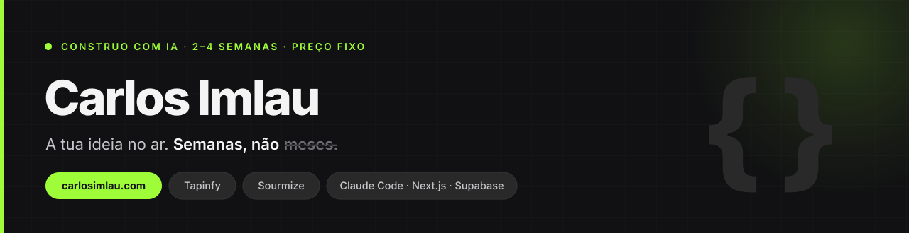

### Dirijo IA para pôr produtos no ar — projetos meus ou de clientes.

Âmbito fechado antes de começar, preço fixo antes de gastares um euro, **2 a 4 semanas** do primeiro e-mail ao produto no ar.

Sim, construo com IA. É por isso que o prazo é semanas e o preço é fixo — o que compras é o produto no ar e alguém que responde por ele.

 

## Produtos

| | O quê | Estado |
|---|---|---|
| **[Tapinfy](https://www.tapinfy.co/)** | Página, agenda e clientes num só lugar para barbearias e negócios de serviços — com a marca e o domínio do dono. O cliente agenda sozinho, sem uma mensagem trocada. €19/mês, zero comissões por agendamento. | 🟢 Em produção |
| **[Sourmize](https://www.sourmize.com/)** | Tracking de links com UTMs geradas por IA e analytics de campanha em tempo real. | 🟢 Em produção |

 

## Como trabalho

**01 · Âmbito fechado** — o que entra, o que fica de fora e o preço. Por escrito. `2–3 dias`

**02 · Construção com IA** — o Claude Code escreve. Eu dirijo, verifico e testo. `2–4 semanas`

**03 · No ar, no teu nome** — domínio, contas e código entregues a ti. `1 dia`

 

## O que é teu fica teu

Código no teu GitHub, domínio e contas no teu nome, pagamentos na tua conta Stripe. No dia em que entrego, já não precisas de mim.

Não sou uma agência — falas comigo, não com um gestor de conta. Não vendo horas, vendo o produto no ar. Não sou uma ferramenta de IA: sou quem a usa e assume a responsabilidade.

 

## Ferramentas que dirijo todos os dias

 

## Falar comigo

Diz-me o que precisas. Respondo em 24 horas.

