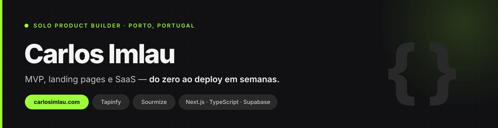

### Transformo ideias em produtos digitais reais — do zero à produção.

Sou **Solo Product Builder**. Construo sites, MVPs e SaaS completos: estrutura, UX, lógica, integrações, versionamento e deploy. Uso IA como alavanca, não como atalho.

O meu trabalho não é escrever código por escrever — é **pôr produtos no ar a funcionar, com ownership total para quem cria**.

 

## Produtos

| | O quê | Estado |
|---|---|---|
| **[Tapinfy](https://www.tapinfy.co/)** | Página profissional para negócios que existem no Instagram mas não convertem fora dele — catálogo, leads, métricas em tempo real, pixels e QR dinâmico. | 🟢 Em produção |
| **[Sourmize](https://www.sourmize.com/)** | Tracking de links com UTMs geradas por IA e analytics de campanha em tempo real. | 🟢 Em produção |

 

## Como trabalho

**Escopo fechado, prazo em semanas.** Do briefing ao domínio a apontar para produção.

**Ownership total.** O repositório, o domínio e as contas ficam no teu nome. Sem mensalidade de refém.

**Decisões, não tarefas.** Trago o que fazer e como fazer — não só a execução.

 

## Stack

 

## Falar comigo

